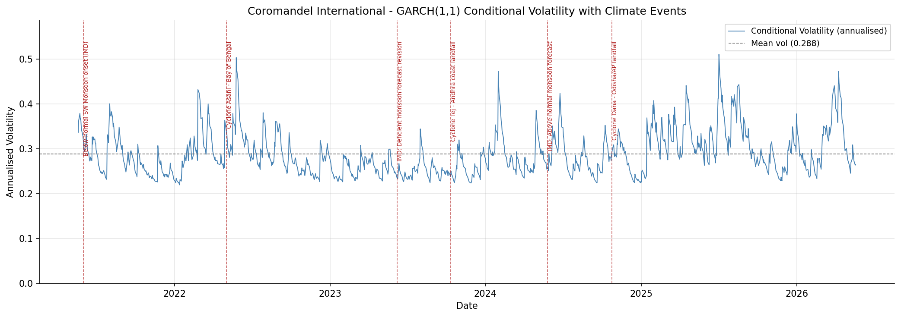
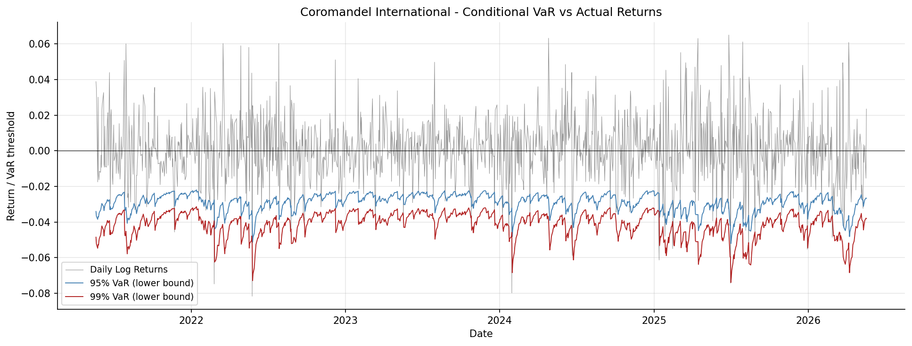
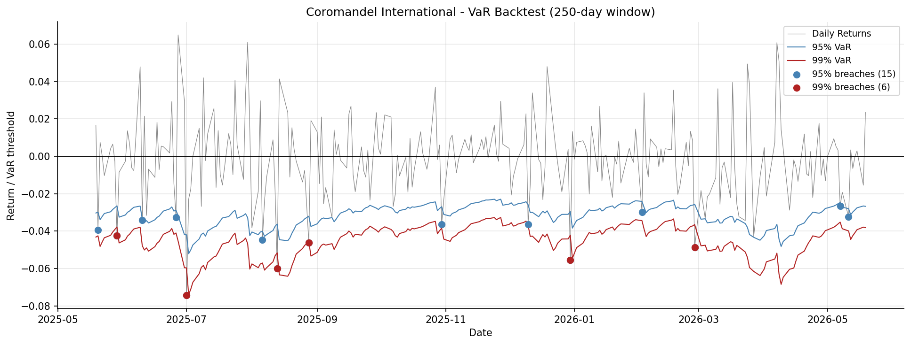

# Volatility Modeling and VaR Estimation - Coromandel International

**Track:** Resume A - Climate & ESG Finance
**Status:** Complete
**Environment:** Python 3.12 (resume-a)
**Last Updated:** 2026-05

---

## Objective

This project models time-varying equity volatility and conditional Value-at-Risk
for Coromandel International (NSE: COROMANDEL), a leading Indian fertiliser and
crop protection company with direct exposure to monsoon variability. The central
question is whether GARCH conditional volatility captures climate-driven risk
episodes - cyclone landfalls, monsoon deficit announcements - that affect
agrochemical demand and margin uncertainty. The methodology follows standard
market risk practice: ARIMA mean equation, GARCH variance equation, conditional
VaR derivation, and Basel traffic light backtest.

This type of analysis is used by climate risk teams at rating agencies, asset
managers, and bank treasury desks to quantify how physical climate events
translate into measurable equity risk.

---

## Data Sources

| Dataset | Source | Period | Notes |
|---|---|---|---|
| COROMANDEL.NS daily prices | Yahoo Finance via yfinance | May 2021 to May 2026 | Adjusted close, 1237 observations |
| IMD Climate Event Archive | https://mausam.imd.gov.in/ | 2021-2026 | Cyclone dates, monsoon forecast revisions |
| RBI Policy Repo Rate | https://www.rbi.org.in | Apr 2026 | 5.25% used as risk-free rate proxy |

---

## Methodology

**Stock selection.** Coromandel International was selected for its direct climate
transmission channel: fertiliser and crop protection revenue is tied to kharif and
rabi crop cycles governed by southwest and northeast monsoon performance. A
below-normal monsoon reduces crop area sown, suppresses fertiliser offtake, and
compresses margins. Three other candidate stocks (NTPC, Adani Green Energy, UPL)
were evaluated and rejected due to optimizer convergence failures from extreme
idiosyncratic returns, governance-related shocks, or absence of statistically
significant ARCH effects.

**Stationarity.** Log returns were computed from 5 years of daily adjusted close
prices. The Augmented Dickey-Fuller test confirmed stationarity (ADF = -27.82,
p < 0.001). Returns are used throughout; price levels are non-stationary and
unsuitable for time series modeling.

**Mean equation.** ACF and PACF inspection identified weak AR(1) structure.
ARIMA(1,0,0) was selected over ARIMA(0,0,0) by AIC (-6371.4 vs -6370.2). The
AR(1) coefficient of -0.051 (p = 0.032) is statistically significant but
economically small, consistent with weak mean reversion at daily frequency.

**ARCH test.** Engle's LM test on ARIMA residuals confirmed time-varying variance
(LM = 26.42, p < 0.001), providing the formal justification for GARCH
specification. Without this test, fitting GARCH is an assumption rather than a
justified modeling choice.

**Variance equation.** GARCH(1,1) with normal innovations was fitted by maximum
likelihood on ARIMA residuals. GARCH(1,1) specifies:

```
sigma^2_t = omega + alpha * epsilon^2_(t-1) + beta * sigma^2_(t-1)
```

All three parameters are significant at the 1% level. Persistence (alpha + beta =
0.915) implies a volatility shock half-life of approximately 8 trading days.

**Conditional VaR.** 1-day VaR was estimated as:

```
VaR_t = mu - z_alpha * sigma_t
```

where mu is the sample mean return and sigma_t is the daily GARCH conditional
volatility. This is a conditional VaR - it varies day to day with current
volatility, unlike static historical simulation VaR.

**Backtest.** 99% VaR was backtested over the last 250 trading days using the
Basel traffic light framework: green zone < 5 breaches, yellow 5-9, red 10+.

---

## Results

**GARCH parameter estimates:**

| Parameter | Estimate | Std Error | p-value |
|---|---|---|---|
| omega | 0.000029 | 0.000001 | < 0.001 |
| alpha (ARCH) | 0.0795 | 0.0240 | < 0.001 |
| beta (GARCH) | 0.8355 | 0.0213 | < 0.001 |
| Persistence | 0.9150 | | |

**Conditional volatility:**

Mean annualised conditional volatility: 28.9% (range: 22.3% to 50.7%). Elevated
volatility periods coincide with dated climate events from IMD records. Cyclone
Asani (May 2022) corresponds to a volatility spike approaching 48% annualised.
Cyclone Tej (Oct 2023) and Cyclone Dana (Oct 2024) both show elevated volatility
in surrounding windows. The deficient monsoon forecast revision (Jun 2023) precedes
a sustained above-mean volatility period through late 2023.



**Conditional VaR:**

| Metric | 95% VaR | 99% VaR |
|---|---|---|
| Mean daily VaR | 2.92% | 4.16% |
| Peak daily VaR | 5.69% | 8.08% |
| Min daily VaR | 2.31% | 3.30% |

Peak 99% VaR of 8.08% occurred on 2025-07-02, nearly double the mean, illustrating
the practical value of time-varying VaR over a static estimate.



**Backtest results:**

| Metric | 95% VaR | 99% VaR |
|---|---|---|
| Breaches observed | 15 | 6 |
| Breaches expected | 12.5 | 2.5 |
| Breach rate | 6.00% | 2.40% |
| Basel zone | Red | Yellow |

The yellow zone result on 99% VaR reflects a structural volatility regime shift
in the backtest window (peak annualised vol 55.7%, July 2025), which exceeds the
historical mean used to calibrate the model.



---

## Limitations

- GARCH(1,1) with normal innovations underestimates tail risk during volatility
  regime shifts; a rolling re-estimation or EGARCH specification would partially
  address this
- Climate event annotations are qualitative; isolating the climate-attributable
  component of volatility requires event study methodology with control windows
- The model captures total equity volatility, not climate-attributable volatility
  specifically; factor decomposition would be needed to separate climate from
  macro and idiosyncratic drivers
- Single-stock analysis; portfolio-level climate risk requires cross-asset
  correlation modeling under stressed scenarios
- Normal innovation assumption; kurtosis of 4.74 in residuals suggests Student-t
  innovations would produce more conservative tail estimates

---

## References

- Yahoo Finance via yfinance: https://pypi.org/project/yfinance/
- IMD Climate Data Portal: https://mausam.imd.gov.in/
- arch library documentation: https://arch.readthedocs.io
- Engle, R. (2003). Risk and Volatility: Econometric Models and Financial Practice.
  Nobel Prize Lecture. https://www.nobelprize.org/prizes/economic-sciences/2003/engle/lecture/
- Basel Committee on Banking Supervision (1996). Supervisory Framework for the Use
  of Backtesting. https://www.bis.org/publ/bcbs22.pdf
- RBI Policy Repo Rate: https://www.rbi.org.in
